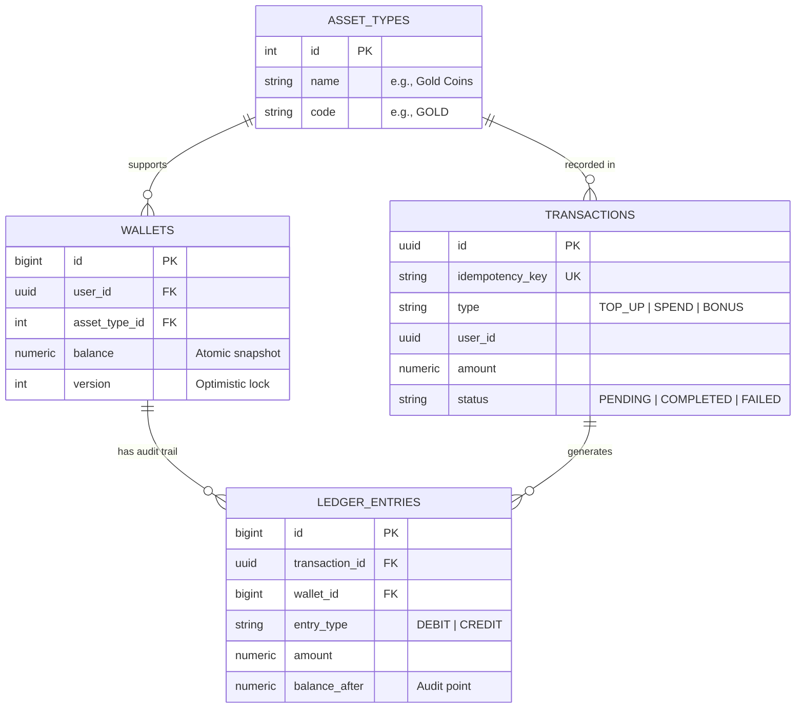
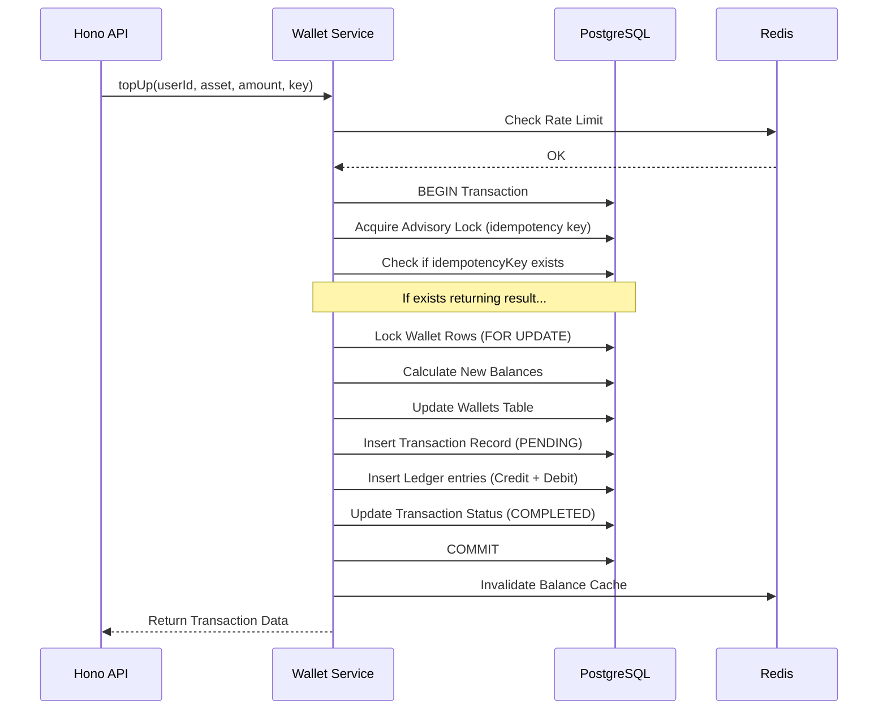

# 🦖 Dino Wallet Service - Technical Guide & Architecture

Welcome to the definitive guide for the **Dino Wallet Service**. This document provides an S-Tier overview of the architecture, design patterns, and engineering decisions behind this high-performance financial microservice.

---

## 🏗️ System Architecture

The service is built using a **Ledger-Based Double-Entry Accounting System**, ensuring mathematical integrity for every transaction. It utilizes a high-performance stack centered around Bun, Hono, and PostgreSQL.

### 🧩 Stack Overview

- **Runtime**: [Bun](https://bun.sh/) (Fastest JS runtime)
- **Framework**: [Hono](https://hono.dev/) (Ultrafast web framework with built-in OpenAPI support)
- **Database**: [PostgreSQL 17](https://www.postgresql.org/) (ACID compliant storage)
- **Caching/Queue**: [Redis](https://redis.io/) (High-speed caching and rate-limiting)
- **Documentation**: [Swagger UI](https://swagger.io/tools/swagger-ui/) (Auto-generated from Zod schemas)

---

## 📈 Data Model & Database Design

### Entity Relationship Diagram (Conceptual)

---

## 🛡️ Concurrency & Integrity Strategy

Generating financial records requires extreme precision. We implement a **Multi-Layered Protection** strategy:

### 1. Consistent Lock Ordering (Deadlock Prevention)

When transferring between two wallets (e.g., User A to Treasury), we **always** sort `user_id`s alphabetically before locking. This prevents "circular waits" where two concurrent processes block each other.

### 2. Transactional Locking (Level 1)

We use `SELECT FOR UPDATE` on wallet rows. This ensures that while a transaction is being calculated, no other process can modify those specific balances.

### 3. Advisory Locking (Level 2)

For critical operations like idempotency checks, we use PostgreSQL **Advisory Locks** (`pg_advisory_xact_lock`). This creates a mutex at the application level for a specific user/asset pair.

### 4. Idempotency Keys

Every transaction requires a unique `idempotencyKey`. Our system ensures that:

- Identical requests are ignored if already processed.
- Results are returned from the transaction log without re-execution.
- Concurrent identical requests are serialized via locking.

---

## 🔄 Transaction Flow (Internal Mechanism)

When a `TOP_UP` or `SPEND` request arrives, the following high-precision flow occurs:

---

## ⚡ Performance Optimizations

### 1. Redis Caching

- **Balances**: Cached for 60 seconds. Automatically invalidated on any balance change.
- **Asset Metadata**: Cached for 1 hour as static metadata.

### 2. Intelligent Rate Limiting

Implemented via a Redis-based sliding window.

- **Global Limit**: Distributes traffic across all endpoints.
- **Sensitive Operations**: Stricter limits for wallet updates to prevent brute-force or spam.

### 3. PostgreSQL Tuning

- Connection pool size increased to **50** for high concurrency.
- `lock_timeout` set to 5s to fail fast rather than hang.
- `statement_timeout` set to 10s to kill zombie queries.

---

## 🛠️ Developer Operations (DevOps)

### Migration Framework

The project uses `node-pg-migrate` and is fully ES-Module compatible.

- **Up**: `bun run migrate:up` (Applies schema)
- **Down**: `bun run migrate:down` (Rolls back changes)
- **Create**: `npm run migrate:create -- description` (Generates template)

### Testing Suite

- **Unit Costs**: Fast functional tests against the service layer.
- **Integration**: End-to-end API testing.
- **Concurrency**: Stress testing for race conditions (targets 200+ TPS).
- **Ledger**: Mathematical reconciliation tests.

### Commands Quick Reference

- `make dev`: Start development server.
- `make test`: Run all tests.
- `make load-test`: Run k6 performance benchmarks.
- `make docker-up`: Spin up the infrastructure.

---

## 📜 Summary Table

| Feature           | Implementation      | Benefit                               |
| :---------------- | :------------------ | :------------------------------------ |
| **Integrity**     | Double-Entry Ledger | Mathematical proof of funds           |
| **Scalability**   | Redis + Bun         | Sub-10ms response times at load       |
| **Reliability**   | ACID Transactions   | No partial failures or lost data      |
| **Security**      | Rate Limiting + Zod | Protected from abuse and invalid data |
| **Documentation** | OpenAPI 3.0         | Self-documenting, interactive API     |

---

_Created by Antigravity AI Engineering team._
